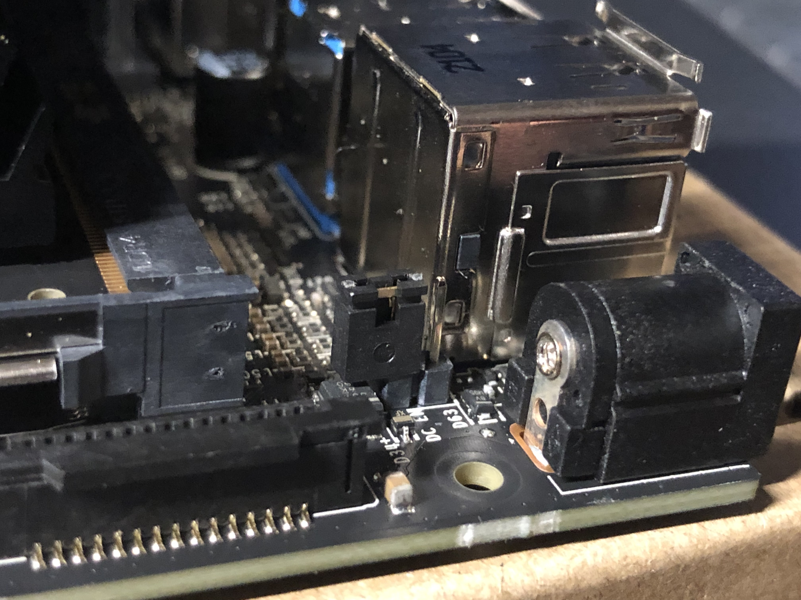
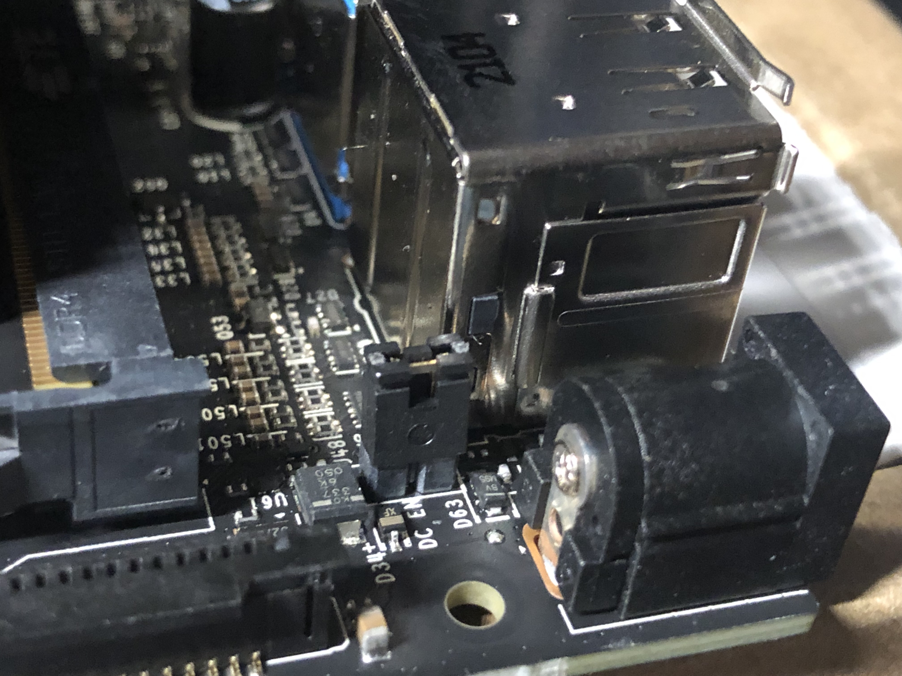
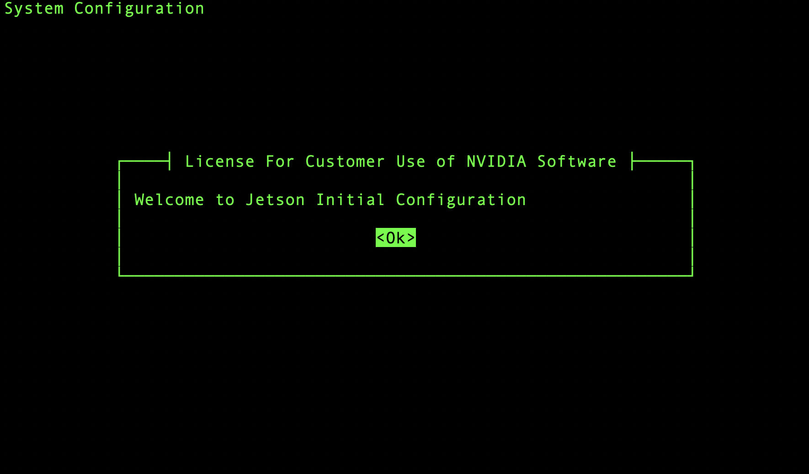
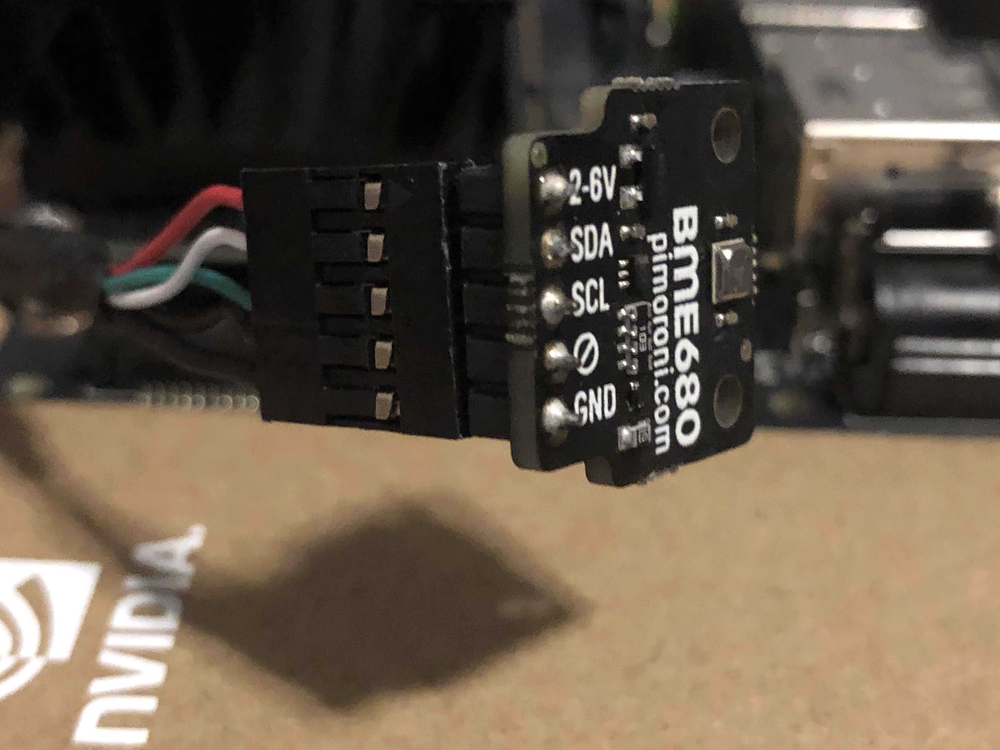
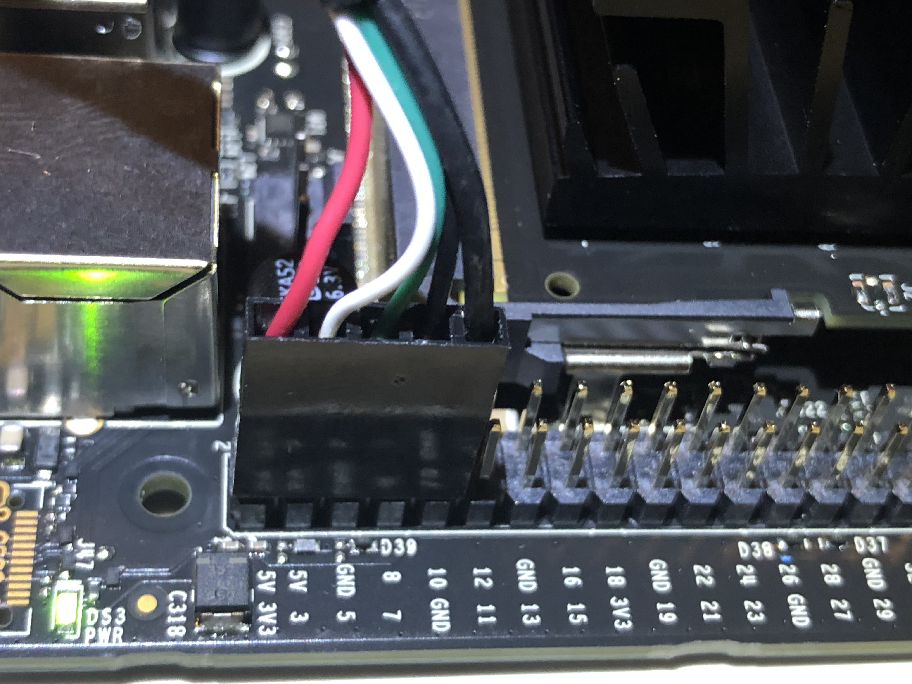

# NVidia Nano Node Platform

Contains the specific instructions and `ansible` playbook for the NVidia Nano Node Platform.

## Table of Contents

1. Hardware needed
2. Bootstrap Steps
3. Enabling `root` SSH access
4. Setting up Ansible on your computer
5. Running The Ansible Playbook
6. Optional Test to run
7. Configuring the Sensors
8. To Do(s) for Dev Team

## Hardware needed
 - [NVIDIA Jetson Nano](https://www.nvidia.com/en-us/autonomous-machines/embedded-systems/jetson-nano/), DC power supply, barrel to set the jumper next to barrel connector to use barrel power, uSD memory cards, SD card reader, etc.
 - 5 pin USB cable
 - network switch
 - Sensors: camera, microphone, & BME680.

>Note: The network switch helps the ansible script run more smoothly. If you are using wifi some disconnecting issues might occur

> Note: The jetson nano can NOT have an IP on the ethernet in the 10.42.0.0 IP space as k3s internal network uses that subnet.  it breaks stuff.

> Dev Note: Copy over hardware from SageEdu repo

## Bootstrap Steps
1. Install [NVidia Nano OS version 4.4.1](https://developer.nvidia.com/embedded/jetpack-sdk-441-archive) for Jetson Nano Developer Kit

2. Follow the instructions on the <a href="https://developer.nvidia.com/embedded/learn/get-started-jetson-nano-devkit#write">
Getting Started with Jetson Nano Developer Kit</a> website to write the image to the microSD card
  
    1. Make sure to follow the correct set of instructions corresponding to your operating system

3. Insert the microSD card into the Nano
    1. The microSD card slot is located on the underside of the Nano
    >Dev Note (TODO): insert in image where the sd card is located
  
4. Jumper the J48 Power Selector Header Pins  
    1. Pins not jumpered:  
  </img>
  
    2. Pins Jumpered:
  </img>

5. ***Recommended*** Connect the network switch

    1. Connect an ethernet cable that is connected to the network switch. This is where the nano will get access to WAN (Wide Area Network ie internet).

    2. Connect an ethernet cable that has access to the internet to the network switch.

    3. Connect your laptop to the network switch with an ethernet cable.

6. Connect your computer to the Nano via it's micro USB port
  
7. Follow the instructions on <a href="https://developer.nvidia.com/embedded/learn/get-started-jetson-nano-devkit#setup-headless">Nvidia's website</a> 
to set up the Nano according to your operating system
</img>

8. Once you are connected to the nano go through the initial set up
    1. Set username to `waggle` and passwd to `waggle`
    > Dev note: come up with a better password later

    2. Set partition size to `0` or leave blank

    3. When you get to the Network Configuration Screen, select the `eth0` option

    4. Set hostname to localhost for now
        > Note: The hostname will change later to node id
    
    5. Use default nvpmodel (MAXN) (10W)

9. In Headless mode, once you are done with the intial set up you will be in the nano's command line for a few seconds before it boots you out

10. Go through step 9 in <a href="https://developer.nvidia.com/embedded/learn/get-started-jetson-nano-devkit#setup-headless">Nvidia's website</a> again to return to the nano's command line

11. Once you are in, it will ask you for your username (waggle) and password you just set up

## You should now be logged in as waggle user in the nano's command line!

Now let's setup `root` SSH access

## Enabling `root` SSH access on Jetson Nano

  1. Get IP for `eth0`
      1. run command `ifconfig eth0`
      
          ```bash
          eth0: flags=4163<UP,BROADCAST,RUNNING,MULTICAST>  mtu 1500
          inet 000.000.0.000  netmask 000.000.000.0  broadcast 000.000.0.000
          inet6 fe80::4ab0:2dff:fe5b:fe63  prefixlen 64  scopeid 0x20<link>
          inet6 0000:000:0000:0000:0000:0000:0000:0000  prefixlen 00  scopeid 0x0<global>
          inet6 0000:000:0000:0000:0000:0000:0000:0000  prefixlen 00  scopeid 0x0<global>
          inet6 0000:000:0000:0000:0000:0000:0000:0000  prefixlen 00  scopeid 0x0<global>
          inet6 0000:000:0000:0000:0000:0000:0000:0000  prefixlen 00  scopeid 0x0<global>
          inet6 0000:000:0000:0000:0000:0000:0000:0000  prefixlen 00  scopeid 0x0<global>
          ether 00:00:00:00:00:00  txqueuelen 1000  (Ethernet)
          RX packets 1371647  bytes 1819095948 (1.8 GB)
          RX errors 0  dropped 0  overruns 0  frame 0
          TX packets 916252  bytes 87050219 (87.0 MB)
          TX errors 0  dropped 0 overruns 0  carrier 0  collisions 0
          device interrupt 151  base 0x5000
          ```

      2. The set of numbers next to inet is your ip address
          ```bash
          inet 000.000.0.000
          ```
          >Note: Write down your Jetson Nano's ip address it is very important in the following steps
  2. Run command `sudo su`
      1. enter in your password ie `waggle`

  3. Set root user password
      1. run command `passwd root`

      2. set password to `waggle`

  4. Enable root user ssh login
      1. run command `vim /etc/ssh/sshd_config`
          1. Go to the bottom of the file
          2. Enter in `PermitRootLogin yes` and `PasswordAuthentication yes` (Make sure they are in seperate lines)
          3. Save and exit the file
          > Note: In vim to enter in insert mode press 'i'. To exit insert mode press 'esc'. To save and quit type in ':wq' and press enter when not in insert mode
      2. run command `service sshd restart` to restart ssh service

## Setting up Ansible on your computer
> Note: `ansible` is _not_ needed on the Nano in order to perform `ansible` provisioning.

1. On your computer, install Ansible

    1. Intructions for Linux

        1. Open a terminal and install pip

            1. Within the terminal, install python 3 and related packages using the command  
                `sudo apt install python3-pip python3-dev`

            2. Make sure to have every package on your system up-to-date so there aren't any dependency issues:  
                `sudo apt update`  
                `sudo apt upgrade`

            3. Upgrade pip by running:  
                `python3 -m pip install --upgrade pip`

        2. Within the terminal, install Ansible using the command `sudo pip install ansible`

        3. You can test that Ansible is installed correctly by checking the version:
            `ansible --version`

    2. Instructions for Macos

        1. Open a terminal and install Homebrew via this command:
            ```
            /bin/bash -c "$(curl -fsSL https://raw.githubusercontent.com/Homebrew/install/HEAD/install.sh)"
            ```
        > Dev Note: check if you need to add Homebrew shell configuration for apple silicon machines
        2. You can test that Homebrew is installed correctly by checking the version: 
            `brew --version`

        3. Within the terminal, install Ansible using the command 
            `brew install ansible`

        4. You can test that Ansible is installed correctly by checking the version:
            `ansible --version`

    3. Instructions for Windows

        1. You cannot use a Windows system for the Ansible control node, so you need to install Windows Subsystem for Linux (WSL)

            1. Prerequisites

                - You must be running Windows 10 version 2004 and higher (Build 19041 and higher) or Windows 11.
                > Note: To check your Windows version and build number, select Windows logo key + R, type winver, select OK. You can update to the latest Windows version by selecting Start > Settings > Windows Update > Check for updates.

            2. You can now install everything you need to run Windows Subsystem for Linux (WSL) by entering this command in Windows Command Prompt
                `wsl --install`

            3. Restart your computer.
        
        2. Once you have installed WSL, you will need to create a user account and password for Ubuntu

            1. You can directly open Ubuntu by visiting the Windows Start menu and typing `Ubuntu`

            2. Once you open Ubuntu, follow the on screen instructions to set up a user account

            3. You are now in Ubuntu's command line!

        3. Installing pip

            1. Within the Ubuntu terminal, install python 3 and related packages using the command  
                `sudo apt install python3-pip python3-dev`

            2. Make sure to have every package on your system up-to-date so there aren't any dependency issues:  
                `sudo apt update`  
                `sudo apt upgrade`

            3. Upgrade pip by running:  
                `python3 -m pip install --upgrade pip`

        2. Within the Ubuntu terminal, install Ansible using the command `sudo pip install ansible`

        3. You can test that Ansible is installed correctly by checking the version:
            `ansible --version`
        >Note: Everytime you need to need to use a terminal for the preceding instructions open Ubuntu by visiting the Windows Start menu and typing `Ubuntu`

2. Set up ssh-keypair with the Jetson Nano

    1. Open a terminal and run the command `ssh-keygen` to create a ssh-key

        1. When asked to enter a file in which to save the key, copy the file path inside the parenthesis ex; `/Users/flozano/.ssh/id_rsa`. Then leave the entry blank and press enter to keep the default file.

        2. If asked to overwrite press `y` and then enter

        3. If asked to enter in a passphrase leave it blank and press enter

    2. Share the ssh-key with your Jetson Nano following this command template
        ```
        ssh-copy-id -i {file path} root@{ip}
        ```
    
    3. After you have replaced `{file path}` with the file path you just coppied and replaced `{ip}` with your Jetson Nano's ip address you can now run the command to share the ssh-key
        - Example
            ```
            ssh-copy-id -i /Users/flozano/.ssh/id_rsa root@130.202.141.76
            ```

3. Open a terminal and travel to your home directory `cd ~`

4. Clone this repository using this command:
    ```
    git clone https://github.com/waggle-sensor/node-platforms.git
    ```

5. Travel into the folder that is holding the Ansible Playbook using this command:
    ```
    cd ~/node-platforms/nvidia-nano
    ```
>Note: Everytime you run an ansible commmand make sure you are in this directory

6. Replace `{ip}` in the `ansible_inventory` file with your Jetson Nano's ip address using vim or any other text editor program
    - After it is replaced it should look similiar to this
        ```
        [nano]
        0.0.0.0 ansible_user=root
        ```

7. You can now test if the Ansible script can reach your Jetson Nano via this command:
    ```
    ansible all -i ansible_inventory -m ping
    ```

## Running The Ansible Playbook

Ansible should now bet set up to run the playbook that will configure your nano to run Waggle Edge Stack (WES). In the `~/node-platforms/nvidia-nano` directory, run this command to start the playbook
```
ansible-playbook -i ansible_inventory 01_ansible_nvidia-nano_base.yaml 
```

Stuff to keep in mind while the ansible script runs:

- **Don't play with the nano while the playbook runs**. It can mess it up!

- **Don't leave your desk while the playbook runs**! The playbook will give you more instructions on what to do as it runs

- If you are ssh-ing over wifi it can cause the ansible playbook to disconnect when the nano reboots

- Connect your hardware when the ansible playbook tells you to

- In the playbook output, `ok` in green means nothing was changed and `changed` in yellow means something was changed in the client (i.e. the Jetson Nano). **Anything in red means something failed and the playbook will stop executing**

- If the playbook fails, it is safe to re run it nothing will be duplicated

## Optional Test to run

- Run command `lsblk` to see the drives configured correctly
> Dev Note: insert in the correct output here

- Check the status of k3s by running this command `service k3s status`
    1. Output should look like this:
    ```bash
    ● k3s.service - Lightweight Kubernetes
    Loaded: loaded (/etc/systemd/system/k3s.service; disabled; vendor preset: enabled)
    Active: inactive (dead)
     Docs: https://k3s.io
    ```

- Execute this command to test if the service is working `service waggle-nodeid status`
    ```bash
    Dev Note: insert correct output here
    ```

### Test k3s and Docker's GPU Access

1. Test k3s service override by running the following commands:
    ```bash
    service k3s status
    systemctl cat k3s
    ```

    - Make sure lan and wan are connected before testing k3s service
        ```
        wan0
        u should have your uplink (to network switch) plugged into the nano ethernet port

        lan0
        u should have the ethernet dongle connected to a usb port
        (this is what you connect the camera to)
        ```
    
        - if this is not the case then you will get this error when running `service k3s status`:
        ```bash
        Process: 7538 ExecStartPre=/usr/bin/nmcli conn up lan (code=exited, status=4)
        ```

    - k3s service should start and the service override should work
    >Dev Note: Insert correct Ouput here

2. If `service k3s status` returns active then test k3s and run basic pod by running the following commands:
    ```bash 
    kubectl get pod -A
    kubectl get node
    ```
    - The output should look like this:
        ```bash
        NAME                           STATUS   ROLES                  AGE   VERSION
        000048b02d5bfe58.wd-nanocore   Ready    control-plane,master   19h   v1.20.2+k3s1
        ```
3. Test dnsmasq by running the following commands:
    ```bash
    service dnsmasq status
    systemctl cat dnsmasq.service
    ```
    >Dev Note: insert the correct output here

4. Test docker's GPU access by running this command `docker run -ti --rm --gpus all waggle/gpu-stress-test:latest`

    - To see if the gpu is being used check the gpu frequency (GR3D_FREQ) by running this command `tegrastats` in a seperate terminal

5. If `service k3s status` returns active and `kubectl get node` returns an active node then test k3s' GPU access by running this command `kubectl run gpu-test --image=waggle/gpu-stress-test:latest --attach=true`
    > Note: You may see the error `error: timed out waiting for the condition`. that is okay. it just means it is taking a long time to create the container in `k3s`

    - It takes a while for the pod to create, to watch the pod creation status run this command `watch kubectl get pod`

    - To see if the gpu is being used check the gpu frequency (GR3D_FREQ) by running this command `tegrastats` in a seperate terminal

6. Once the pod stops running (~5 min) delete the pod by running this command `kubectl delete pod gpu-test &`

### Testing the local dev docker registry
1. To test the local dev docker registry run the following commands:
    ```bash
    curl https://10.31.81.1:5000/v2/_catalog
    ```
    - Output:
    ```bash
    {"repositories":[]}
    ```

2. Ensure you can pull from local registry by running the following commands:
    ```bash
    docker pull ubuntu:latest

    docker tag ubuntu:latest 10.31.81.1:5000/joe:latest

    curl https://10.31.81.1:5000/v2/_catalog
    ```
    - Output
    ```bash
    {"repositories":[]}
    ```

3. Ensure you can push to local registry by running this command:
    ```bash
    docker push 10.31.81.1:5000/joe:latest
    ```
    - Output
    ```bash
    13e8c0db60e7: Pushed
    latest: digest: sha256:0f744430d9643a0ec647a4addcac14b1fbb11424be434165c15e2cc7269f70f8 size: 529
    ```
    > Note: while doing the above `push` you should see logs in `docker logs -f local_registry`

4. You should now see a repository by running this command `curl https://10.31.81.1:5000/v2/_catalog`

    - Output
    ```bash
    {"repositories":["joe"]}
    ```
    

### Testing to see if WES is running

After registration, the Beehive should automatically push WES to the node and start running its pods. To see this run the command `kubectl get pod`
```bash
NAME                                        READY   STATUS              RESTARTS   AGE
wes-audio-server-75847fd59-5ql4n            0/1     Pending             0          11m
wes-gps-server-6dd8f84cb9-pkrvf             0/1     Pending             0          11m
node-exporter-mdc5x                         1/1     Running             0          11m
wes-upload-agent-pcjdn                      1/1     Running             0          11m
wes-scoreboard-679ccdddb7-zfxms             1/1     Running             0          11m
wes-metrics-agent-5frxw                     1/1     Running             0          11m
wes-device-labeler-8vqdh                    1/1     Running             0          11m
wes-node-influxdb-0                         1/1     Running             0          11m
wes-camera-provisioner-1657315800-56t8f     0/1     ContainerCreating   0          4m56s
wes-sciencerule-checker-646b4c6c4-h7clz     1/1     Running             0          11m
wes-data-sharing-service-84b7958dd9-l4642   1/1     Running             4          11m
wes-plugin-scheduler-c665b68b5-72r5z        1/1     Running             0          11m
wes-rabbitmq-0                              1/1     Running             1          11m
wes-node-influxdb-loader-6b58f7474-25k8n    1/1     Running             3          11m
```

- You should start seeing metrics being published to the Beehive data store

```bash
$ curl -s 1-H 'Content-Type: application/json' https://data.sagecontinuum.org/api/v1/query -d '{"start": "-125s","filter": {"vsn": "N001"}}'  | grep uptime
{"timestamp":"2022-07-08T21:37:50.542686843Z","name":"sys.uptime","value":12617.5,"meta":{"host":"000048b02d5bfe58.wd-nanocore","node":"000048b02d5bfe58","vsn":"N001"}}
```

## Configuring the Sensors

### BME680

1. Connect in the 5 pin USB cable into the environmental sensor with the black wire connected to the ground pin
  </img>

2. **With the Nano powered off**, connect the other end of the cable into the nano on the bottom leftmost set of 5 pins on the 40-pin expansion header.
The black wire should connect to the ground pin and the red wire should connect to the pin labeled 3v3
  </img>

3. Run this command to see if the sensor is being detected by i2c. `i2cdetect -y -r 1 0x76 0x77`

    ```bash
    root@wd-nanocore-000048B02D5BFE58:~# i2cdetect -y -r 1 0x76 0x77
        0  1  2  3  4  5  6  7  8  9  a  b  c  d  e  f
    00:                                                 
    10:                                                 
    20:                                                 
    30:                                                 
    40:                                                 
    50:                                                 
    60:                                                 
    70:                   76 -- 
    ```
> Note: **The sensor can either be on 0x76 or 0x77**. Based on what address it's on the number will change in the documentation

4.  The kernel supplied by nvidia doesn't support the BME680 sensor, so we just have to get the kernel source of a kernel version supporting the sensor (4.19)
`wget http://www.kernel.org/pub/linux/kernel/v4.x/linux-4.19.116.tar.gz`

5.  Extract the drivers/iio/chemical subtree of the kernel source for building the bme680 sensors kernel module
`tar --strip-components=3 -xzf linux-4.19.116.tar.gz linux-4.19.116/drivers/iio/chemical`

6.  After extracting, we have to configure the build. To do so, prepend the following lines to the Makefile in this subtree `vim chemical/Makefile`

    ```
    CONFIG_BME680=m
    CONFIG_BME680_I2C=m
    ```

7.  Afterwards build the kernel module and install the binaries to the modules folder by running the following commands:

    1. `make -C /lib/modules/`uname -r`/build M=$PWD`

    2. `make -C /lib/modules/`uname -r`/build M=$PWD modules_install`

8.  Build the module's dependency list by running the command `depmod -a`

9.  Run command `modprobe bme680_i2c` to see if the module was successfully installed
> Note: If there is no output then the module was installed correctly

10.  To use the sensor we have to register it with the kernels i2c subsystem so run this command `echo bme680 0x76 > /sys/bus/i2c/devices/i2c-1/new_device`
> Note: change number to 77 if that's the address the sensor is on

11. Check if the BME680 sensor is registered by running the command `cat /sys/bus/iio/devices/*/name`

    ```bash
    root@<id>:~# cat /sys/bus/iio/devices/*/name

    ina3221x
    bme680
    ```

12.  Once the sensor is registered, the sensors readings can be acquired using the sysfs interface:

        ```bash
        root@<id>:~#  grep ^ /dev/null /sys/bus/i2c/devices/i2c-1/1-0076/iio:device1/*input*

        /sys/bus/i2c/devices/i2c-1/1-0076/iio:device1/in_humidityrelative_input:63.827000000
        /sys/bus/i2c/devices/i2c-1/1-0076/iio:device1/in_pressure_input:984.630000000
        /sys/bus/i2c/devices/i2c-1/1-0076/iio:device1/in_resistance_input:7234
        /sys/bus/i2c/devices/i2c-1/1-0076/iio:device1/in_temp_input:24510
        ```
> Note: If your sensor is on 0x77 the relative path will be `/sys/bus/i2c/devices/i2c-1/1-0077/iio:device1/*input*`

13. If your outputs in steps 11 & 12 are similiar then configure the nano to set bme680 on boot

    1. To load the bme680_i2c kernel module on startup add it to the modules.conf file by running this command `echo bme680_i2c >> /etc/modules-load.d/modules.conf`

    2. Next, we have to register the sensor with the kernels i2c subsystem on startup. To do so we have to create a rc.local file since ubuntu 18.04 doesn't have it by default. `vim /etc/rc.local`

        1. Go into insert mode, and paste the following content

            ```bash
            #!/bin/sh -e
            #
            # rc.local
            #
            # This script is executed at the end of each multiuser runlevel.
            # Make sure that the script will "exit 0" on success or any other
            # value on error.
            #
            # In order to enable or disable this script just change the execution
            # bits.
            #
            # By default this script does nothing.

            # Add bme680 to i2c
            echo bme680 0x76 > /sys/bus/i2c/devices/i2c-1/new_device

            exit 0
            ```

        2. Escape insert mode, save and quit file

        3. Give execution permission to the file `chmod +x /etc/rc.local`

14. Reboot and on startup run steps 11 & 12 again to see if the BME680 sensor is set up on boot
