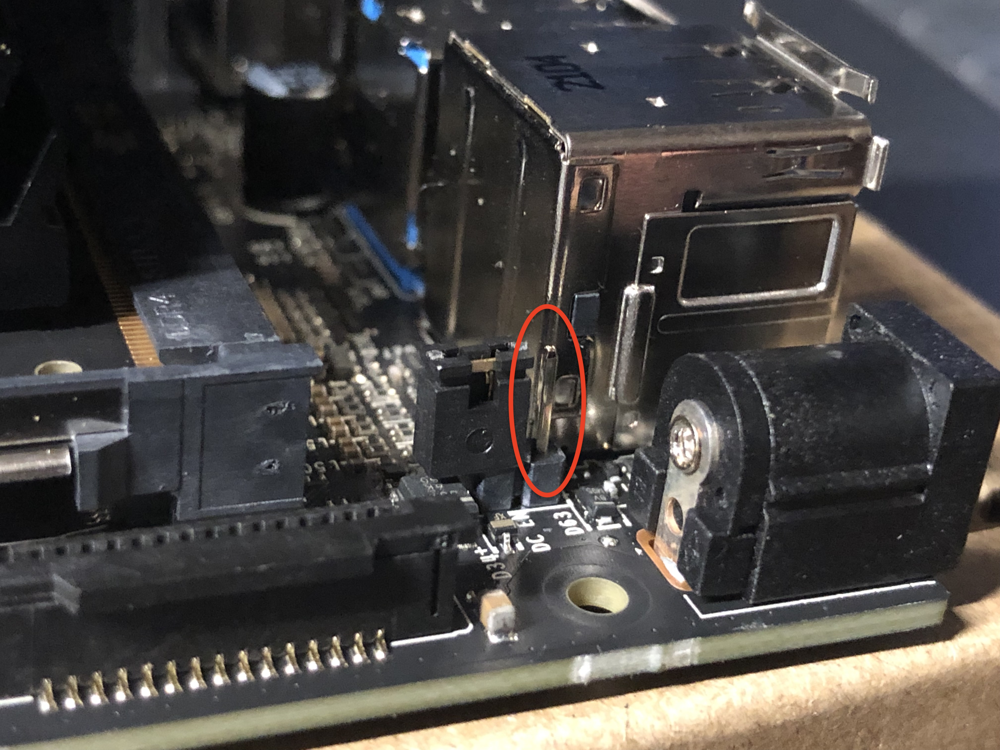
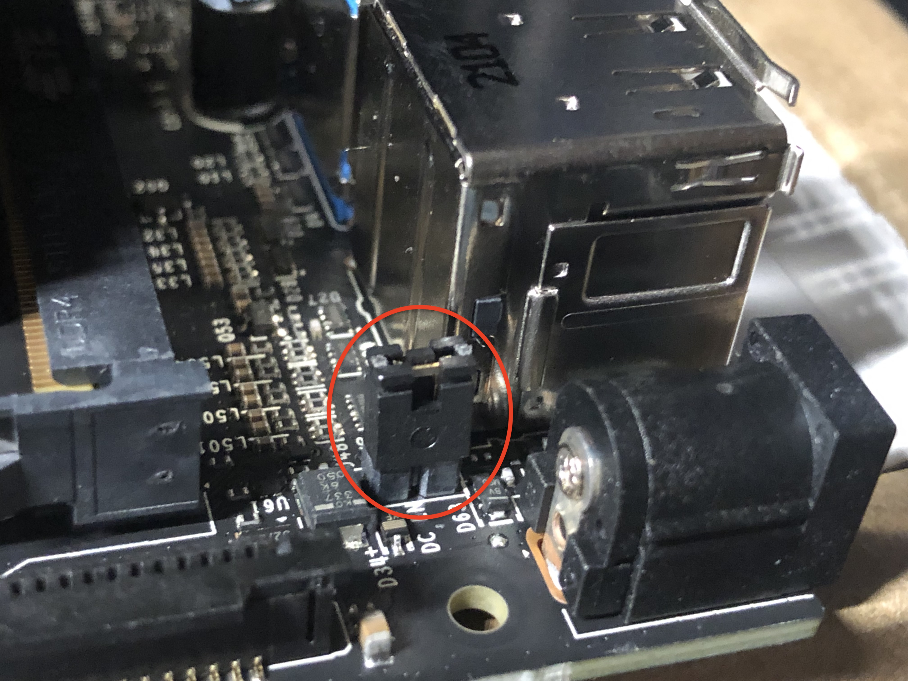
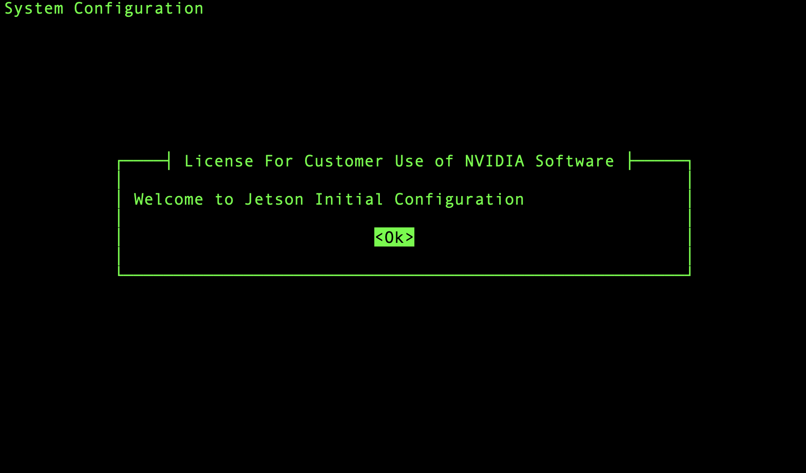

# Bootstrapping Jetson Nano

This guide will show how to install JetPack SDK 4.4.1, turn on the nano, connect and initially set up the nano

**Required skills:** 
* Opening and closing command line on your computer

**Helpful guides:**
* [Open or quit Terminal on Mac](https://support.apple.com/guide/terminal/open-or-quit-terminal-apd5265185d-f365-44cb-8b09-71a064a42125/mac)
* [10 Ways to Open the Command Prompt in Windows 10](https://www.howtogeek.com/235101/10-ways-to-open-the-command-prompt-in-windows-10/)

--- 

### Bootstrap Steps
1. Install [NVIDIA Nano OS version 4.4.1](https://developer.nvidia.com/embedded/jetpack-sdk-441-archive) SD Card Image Method for Jetson Nano Developer Kit

2. Follow the instructions on the <a href="https://developer.nvidia.com/embedded/learn/get-started-jetson-nano-devkit#write">Getting Started with Jetson Nano Developer Kit</a> website to write the image to the microSD card
  
    1. Make sure to follow the correct set of instructions corresponding to your operating system

3. Insert the microSD card into the Nano
    1. The microSD card slot is located on the underside of the Nano
    
  
4. Jumper the J48 Power Selector Header Pins  
    1. Pins not jumpered (notice how one of the pins is exposed and not covered by the jumper):  
  
  
    2. Pins Jumpered (both pins covered by jumper):
  

5. Connect to the internet

    1. Connect the nano to the internet with an ethernet cable. This is where the nano will get access to WAN (Wide Area Network ie internet).

    2. Do the same with your laptop.

6. Connect your computer to the Nano via it's micro USB port

7. Connect the nano's power supply. 
   > Note: At this point only the ethernet cable, micro-usb to usb (micro-usb side), and power cord should be connected to the nano. 
  
8.  Follow step 9 on <a href="https://developer.nvidia.com/embedded/learn/get-started-jetson-nano-devkit#setup-headless">Initial Setup Headless Mode</a> to set up the Nano according to your operating system

1. Once you are connected to the nano go through the initial set up
   >Note: you can navigate the serial UI with the arrow keys and "enter/return" button on your keyboard
    1. Set full name to **waggle**, username to **waggle** and password to **waggle**

    2. Set partition size to **0** or leave blank

    3. When you get to the Network Configuration Screen, select the **eth0** option

    4. Set hostname to **localhost**
        > Note: The hostname will change later to node id
    
    5. Use default nvpmodel (MAXN) (10W)

2. In Headless mode, once you are done with the initial set up you will be in the nano's command line for a few seconds before it boots you out

3.  Go through step 9 in <a href="https://developer.nvidia.com/embedded/learn/get-started-jetson-nano-devkit#setup-headless">Initial Setup Headless Mode</a> again to return to the nano's command line

4.  Once you are in, it will ask you for your username (waggle) and password you just set up

##### You should now be logged in as waggle user in the nano's command line!
Continue to [Installing Ansible on your Computer](./installing_ansible.md)